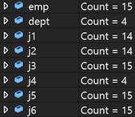
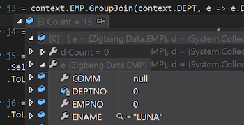
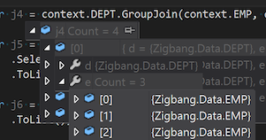
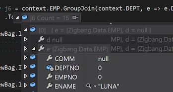

## C# LINQ Outer Join

LINQ로 outer join 을 하는 방법을 검색해서 나오는 방법들이 대부분 Microsoft 공식 페이지에 나와있는 방법대로 하는 것들인데 문제는 그게 제대로 동작하지 않는다.

<https://docs.microsoft.com/en-us/dotnet/articles/csharp/linq/perform-left-outer-joins>

그래서 더 찾아보니 `GroupJoin` 과 `SelectMany`를 활용해서 outer join 과 동일한 결과로 표현이 가능한 방법이 있었다.

- `GroupJoin` : `Join`을 수행하면서 outer table 기준으로 inner table 의 항목들을 `Collection`으로 만들어 줌.
- `SelectMany` : `Select`를 수행시 `IEnumerable`한 항목을 풀어서 수행한다.
좀 더 쉽게 설명하자면 2중 `List`가 있을 경우 `List`안의 `List`를 풀어서 그냥 `List`로 만들어 준다.
다른 언어의 **rx**의 `FlatMap`과 동일한 기능다.

이 둘을 이용해서 inner table을 `GroupJoin`으로 수행하면서 그 결과 값이 없는 경우 `DefaultOfEmpty`를 활용해서 생성한 후 `SelectMany`로 `GroupJoin`시 생성되었던 `Collection`을 flat하게 풀어주면 일반적인 형태의 outer join을 한것과 같은 결과를 얻을 수 있다.


### 예제 SQL문

예제에 사용할 SQL 데이터 이다.  
참고로 **Oracle**의 `EMP`, `DEPT` 테이블의 내용이며, 아래 SQL 문법은 **MySQL** 용으로 작성되었다.

```SQL
CREATE TABLE EMP (
  EMPNO INT PRIMARY KEY ,
  ENAME VARCHAR(10),
  JOB VARCHAR(9),
  MGR INT,
  HIREDATE DATE,
  SAL DOUBLE,
  COMM DOUBLE,
  DEPTNO INT
);

INSERT INTO EMP VALUES (7369, 'SMITH',  'CLERK',     7902, '1980-12-17',  800, NULL, 20);
INSERT INTO EMP VALUES (7499, 'ALLEN',  'SALESMAN',  7698, '1981-02-20',  1600,  300, 30);
INSERT INTO EMP VALUES (7521, 'WARD',   'SALESMAN',  7698, '1981-02-22',  1250,  500, 30);
INSERT INTO EMP VALUES (7566, 'JONES',  'MANAGER',   7839, '1981-04-02',  2975, NULL, 20);
INSERT INTO EMP VALUES (7654, 'MARTIN', 'SALESMAN',  7698, '1981-09-28',  1250, 1400, 30);
INSERT INTO EMP VALUES (7698, 'BLAKE',  'MANAGER',   7839, '1981-05-01',  2850, NULL, 30);
INSERT INTO EMP VALUES (7782, 'CLARK',  'MANAGER',   7839, '1981-06-09',  2450, NULL, 10);
INSERT INTO EMP VALUES (7788, 'SCOTT',  'ANALYST',   7566, '1982-12-09', 3000, NULL, 20);
INSERT INTO EMP VALUES (7839, 'KING',   'PRESIDENT', NULL, '1981-11-17', 5000, NULL, 10);
INSERT INTO EMP VALUES (7844, 'TURNER', 'SALESMAN',  7698, '1981-09-08',  1500, NULL, 30);
INSERT INTO EMP VALUES (7876, 'ADAMS',  'CLERK',     7788, '1983-01-12', 1100, NULL, 20);
INSERT INTO EMP VALUES (7900, 'JAMES',  'CLERK',     7698, '1981-12-03',   950, NULL, 30);
INSERT INTO EMP VALUES (7902, 'FORD',   'ANALYST',   7566, '1981-12-03',  3000, NULL, 20);
INSERT INTO EMP VALUES (7934, 'MILLER', 'CLERK',     7782, '1982-01-23', 1300, NULL, 10);

CREATE TABLE DEPT (
  DEPTNO INT PRIMARY KEY ,
  DNAME VARCHAR(14),
  LOC VARCHAR(13)
);

INSERT INTO DEPT VALUES (10, 'ACCOUNTING', 'NEW YORK');
INSERT INTO DEPT VALUES (20, 'RESEARCH',   'DALLAS');
INSERT INTO DEPT VALUES (30, 'SALES',      'CHICAGO');
INSERT INTO DEPT VALUES (40, 'OPERATIONS', 'BOSTON');
```

위까지가 원래 데이터이며, 테스트를 위해서 inner join에 해당하지 않는 데이터를 하나 추가하였다.

```SQL
INSERT INTO EMP VALUES (0, 'LUNA', 'MASTER',     7782, '1982-01-23', 1300, NULL, 0);
```

### LINQ 실행

테스트를 위해 실행시킨 LINQ 문장은 아래와 같다.

```C#
var emp = context.EMP.ToList();
var dept = context.DEPT.ToList();

var j1 = context.EMP.Join(context.DEPT, e => e.DEPTNO, d => d.DEPTNO, (e, d) => new {e, d}).ToList();
var j2 = context.EMP.Join(context.DEPT.DefaultIfEmpty(), e => e.DEPTNO, d => d.DEPTNO, (e, d) => new { e, d }).ToList();

var j3 = context.EMP.GroupJoin(context.DEPT, e => e.DEPTNO, d => d.DEPTNO, (e, d) => new { e, d }).ToList();

var j4 = context.DEPT.GroupJoin(context.EMP, d => d.DEPTNO, e => e.DEPTNO, (d, e) => new { d, e }).ToList();

var j5 = context.EMP.GroupJoin(context.DEPT, e => e.DEPTNO, d => d.DEPTNO, (e, d) => new { e, d = d.DefaultIfEmpty() })
    .SelectMany(j => j.d.Select(d => new { j.e, d}))
    .ToList();

var j6 = context.EMP.GroupJoin(context.DEPT, e => e.DEPTNO, d => d.DEPTNO, (e, d) => new { e, d = d.FirstOrDefault() }).ToList();
```



실행 결과에 대해서 `IEnumerable`의 `Count`를 먼저 살펴보자.

**EMP** 와 **DEPT**는 테이블에 들어가 있는 레코드 수가 그대로 반영되었다.  

```C#
var j1 = context.EMP.Join(context.DEPT, 
    e => e.DEPTNO, d => d.DEPTNO,
    (e, d) => new {e, d})
    .ToList();
```

**j1**은 보통 많이쓰는 `Join`으로 실행시켰다. inner join을 수행하므로 마지막에 테스트로 넣은 **LUNA**의 경우 **DEPTNO**로 조인이 되지 않아서 14개가 되는게 맞다.  

```C#
var j2 = context.EMP.Join(context.DEPT.DefaultIfEmpty(),
    e => e.DEPTNO, d => d.DEPTNO,
    (e, d) => new { e, d })
    .ToList();
```

**j2**는 Microsoft 공식 문서에 나와있는 방법대로 inner table 쪽에 `DefaultIfEmpty`를 수행했는데도 14개로 inner join한 것과 같은 결과가 나왔다.  

```C#
var j3 = context.EMP.GroupJoin(context.DEPT,
    e => e.DEPTNO, d => d.DEPTNO,
    (e, d) => new { e, d })
    .ToList();
```

**j3**을 보니 우리가 원하던대로 15개의 결과가 나왔다.
결과를 좀 더 자세히 보니 **LUNA**에 조인된 `d`가 `null`로 들어와있다.



이제 원하는 결과를 얻었다고 생각이되지만, 나머지 항목에 대해서는 `d`가 `Collection`으로 되어 있으며 그 안에 `DEPT`가 1개씩 들어가 있어서 별로 보기에 좋지가 않다.
일단 여기서 넘어가고 아래에서 좀 더 이쁘게 만들어 보겠다.

```C#
var j4 = context.DEPT.GroupJoin(context.EMP,
    d => d.DEPTNO, e => e.DEPTNO,
    (d, e) => new { d, e })
    .ToList();
```

위에서 설명한 `GroupJoin`이 어떻게 동작하는지 보기위해서 **j4**에서는 `DEPT`를 outer table로 하고 `EMP`를 inner table로 하여 수행해 보았다.
`d`에 해당하는 `e`에 여러개의 `EMP`가 `Collection`으로 들어가 있는게 확인 가능하다.



```C#
var j5 = context.EMP.GroupJoin(context.DEPT,
    e => e.DEPTNO, d => d.DEPTNO,
    (e, d) => new { e, d = d.DefaultIfEmpty() })
    .SelectMany(j => j.d.Select(d => new { j.e, d}))
    .ToList();

var j6 = context.EMP.GroupJoin(context.DEPT,
    e => e.DEPTNO, d => d.DEPTNO,
    (e, d) => new { e, d = d.FirstOrDefault() })
    .ToList();
```

**j5**와 **j6**는 **j3**에서 이쁘지 않았던 모양을 좀 더 사용하기 좋도록 만든 것이다.
**j3**에서 만든 `Collection`을 풀어서 flat하게 만들어주는게 **j5**, **j6**이다.
이 경우에서는 둘의 결과는 똑같다.



하지만 모든 경우에 있어서 둘의 결과가 똑같지는 않다.  

**j5**에서는 `EMP`에 해당하는 `DEPT`가 여러 개 있는 경우 그걸 여러개의 결과로 나눠준다.  
**j6**에서는 `EMP`에 해당하는 `DEPT`가 여러 개가 있더라도 그중 1개만 결과로 남고 나머지는 무시된다.  

위에서 생성한 테이블에서는 outer join을 할려는 목적이 `DEPT`가 1개이거나 없거나 하는 경우라서 **j6**방법으로 사용해도 되지만, 대부분의 경우에는 **j5** 방법대로 해야한다.