# # AWS Lambda에 C# Handler 만들기 

**AWS Lambda**에 대해 다루는 7번째 글입니다.

- [Lambda 와 API Gateway 연동 #1 (GET, POST)](https://github.com/DevStarSJ/Study/blob/master/Blog/Cloud/AWS/Lambda%2BAPIGateWay.01.md)
- [Lambda 와 API Gateway 연동 #2 (ANY, Deploy Staging, Node.JS Route)](https://github.com/DevStarSJ/Study/blob/master/Blog/Cloud/AWS/Lambda%2BAPIGateway.02.Route.md)
- [Lambda 와 API Gateway 연동 #3 (Proxy Resource)](https://github.com/DevStarSJ/Study/blob/master/Blog/Cloud/AWS/Lambda%2BAPIGateway.03.Proxy.md)
- [Lambda Node.JS Packaging](https://github.com/DevStarSJ/Study/blob/master/Blog/Cloud/AWS/Lambda.Packaging.Node.md)
- [AWS Lambda에 Python Handler 만들기](https://github.com/DevStarSJ/Study/blob/master/Blog/Cloud/AWS/Lambda.Python.md)
- [Lambda Python Packaging](https://github.com/DevStarSJ/Study/blob/master/Blog/Cloud/AWS/Lambda.Packaging.Python.md)

2016년 12월 1일부터 (글쓴 날 기준으로 이틀 전) **AWS Lambda**에서 **C#**을 지원해 줍니다.  
(관련글 : <https://aws.amazon.com/about-aws/whats-new/2016/12/aws-lambda-supports-c-sharp>)

**.NET Framework**를 사용할리는 없겠구요.(그 무거운 프레임워크 위에서 돌리는 버전은 당연히 아니겠죠.)
**.NET Core 1.0 runtime** 을 이용하여 **C#** 코드를 컴파일하고 실행해 줍니다.
**AWS**에서 지원해준다니깐 잘되는지 직접 한 번 해봤습니다.

## 개발 환경

현재 **macOS**를 사용중이지만, **C#** 개발 환경으로 가장 쾌적하고 좋은건 역시 **Windows**에서 실행시키는 **Visual Studio** 입니다.
[Visual Studio for Mac](https://www.visualstudio.com/vs/visual-studio-mac) 이 출시되긴 했으나, 사용해보니 너무나도 느리고 답답하더라구요.
차라리 **Parallels Desktop**에 **Windows 10**을 띄우고 거기서 **Visual Studio Community 2015**로 하는게 훨씬 더 빠르고 편했습니다.

아래의 개발도구들을 사용했습니다.

- **Visual Studio 2015 Community with Update 3** , **.NET Core 1.0.1 tools Preview 2** : <https://www.microsoft.com/net/core>
- **AWS Toolkit for Visual Studio** : <https://aws.amazon.com/visualstudio>

## Project 생성

- **Visual Studio** 실행한 뒤 **File** -> **New** -> **Project** 선택

- **Visual C#** -> **AWS Lambda** -> **AWS Lambda Project (.NET Core)** 선택
  - **Name** : `AWSLambdaTest` 라고 입력한 후 **OK** 버튼 클릭

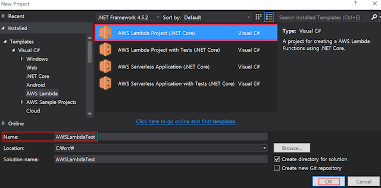

- **Select Blueprint** 창에서 **Empty Function**을 선택한 후 **Finish** 버튼 클릭

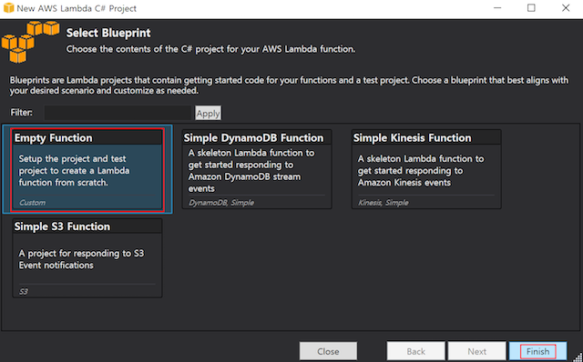

이제 테스트 프로젝트가 완성되었습니다.

## AWS Explorer 에 로그인

**AWS Lambda** 배포를 좀 더 편하게 하기위해서 미리 **AWS Explorer**에 로그인해 두도록 하겠습니다.
화면에 **AWS Explorer**가 없다면, **View** -> **AWS Explorer**를 선택하시면 됩니다.
만약 해당 메뉴가 나오지 않는다면 **AWS Toolkit for Visual Studio**를 설치하지 않은 것이므로 위 링크에서 설치를 하신 뒤 진행해 주세요.
이미 로그인 된 상태라면 아래 과정을 진행 할 필요가 없습니다.

- **New Account Profile** 선택
  - **Profile Name** : 아무거나 입력. 화면에 표시될 내용이므로 구분하기 쉽게
  - **Access Key ID** , **Secret Access Key** : AWS에서 발급받은 값으로 입력

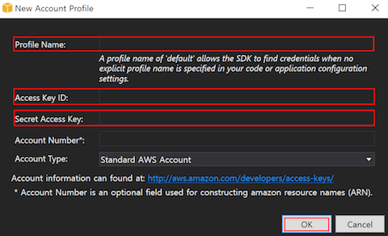

로그인이 제대로 되었다면 아래 그림과 같이 **AWS Service** 목록이 나옵니다.

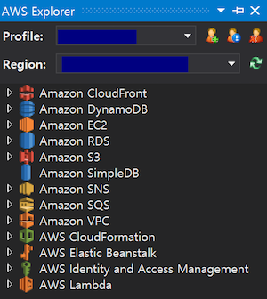

## Projeject 코드 설명

먼저 빌드를 한 번 해보세요.
만약 빌드가 안된다면 **Solution Explorer**를 열어서 Project 내의 **References**를 열어봐 주세요.
설치된 어셈블리 중에 잘못 된게 있으면 노란색 느낌표가 뜹니다.
그럴 경우 우클릭하여서 **Restore Packages**를 선택해 주세요.

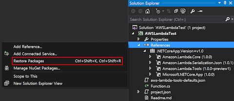


자동 생성된 **Function.cs** 파일을 열어보겠습니다.

눈여겨 볼 부분이 두 곳 정도 있네요.

```CSharp
// Assembly attribute to enable the Lambda function's JSON input to be converted into a .NET class.
[assembly: LambdaSerializerAttribute(typeof(Amazon.Lambda.Serialization.Json.JsonSerializer))]
```

주석에 적혀있는 대로 라면 **JSON**으로 입력된 것에 대해서 자동으로 **.NET class**로 변경해준다는 말이네요.
**AWS Lambda**에 **Java** 코드를 올릴 경우에도 입력이 **JSON**일 경우 해당 **JSON**내용이랑 똑같은 **class**를 생성해야만 했습니다.
더군다나 **Java**에서는 **setter** , **getter** 매서드 들도 다 만들어 줘야 했습니다.
다행히 **C#**에서는 **attribute**로 선언시 오른쪽에 `{ get; set; }`만 적어주면 되기 때문에 **Java**보다는 훨씬 편하지만,
그래도 여간 귀찮은 일이 아닙니다.

관련 내용으로 **Facebook**애서 좀 장장댔더니 고수이신 패친분들이 **JSON**을 읽어서 **class**를 만들어주는 방법들에 대해서 소개를 해 주셨습니다.
(엯촋 이규원님, 이종인님 감사드립니다.)
보니깐 **Visual Studio**에는 이미 그런 기능이 있군요.

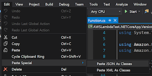

저렇게 **class**로 만들기 싫다면, 그냥 `Stream`으로 주고 받는 방법도 있습니다.
아래 내용에서는 `Stream`으로 주고 받는 방법으로 진행하도록 하겠습니다.

```CSharp
public string FunctionHandler(string input, ILambdaContext context)
{
	return input?.ToUpper();
}
```

**string**을 입력받아서 대문자로 변경한 뒤에 **string** 타입으로 응답해주는 핸들러입니다.

일단은 이 코드 그대로 배포해 보도록 하겠습니다.

## **Lambda** 배포 및 테스트

**Visual Studio** 내에서 배포 및 테스트가 바로 되기 떄문에 편리합니다.

- **Solution Explorer**상의 Project(**AWSLambdaTest**)에서 마우스 우 클릭
  - **Publish to AWS Lambda...** 선택

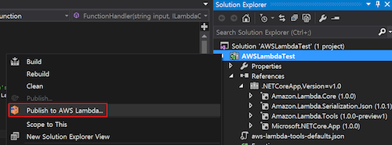

- **Function Name:** 새로 생성할 (또는 기존에 생성되어 있는 것 중 덮어 쓸) Lambda Function 명칭을 입력

**Assembly Name** (Project 명), **Type Name** (핸들러가 포함되어 있는 class명을 namespace 포함한 값), **Method Name** (핸들러 이름)이 제대로 되어 있는지 확인합니다.

- **Next** 버튼 클릭

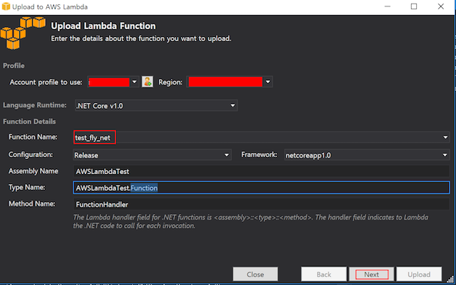

- **Role Name:** 기존에 만들어 놓은 **role**또는 새로 만들어서 선택

참고로 **role**은 **AWS**내의 다른 서비스 들과의 연계에서 필요한 권한 등을 설정해 놓는 것입니다.

- **Upload** 버튼 클릭

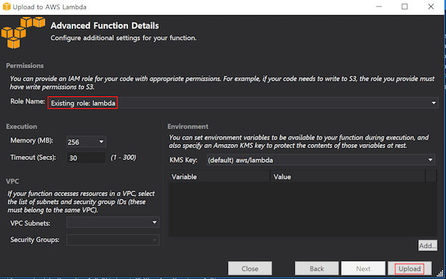

이제 기다리면 업로딩이 끝난 뒤 해당 **Lambda**의 설정창이 뜹니다.
기본적으로 **Test Function** 탭이 선택된 상태인데 **Sample Input**란에 아무거나 입력한 뒤 **Invoke** 버튼을 누르면 입력한 값들이 모두 대문자로 변한 값으로 응답이 오는 것을 확인 할 수 있습니다.

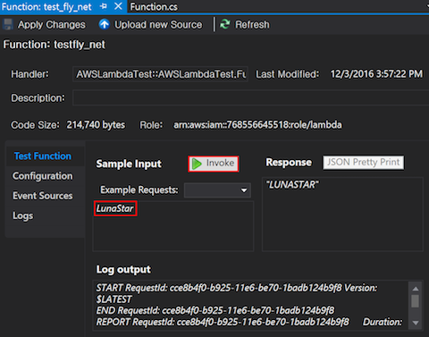

만약 입력하는 문자열이 **JSON** 형식일 경우에는 오류가 발생합니다.


앞에서 살펴 본 코드에 따르면 **JSON**을 읽어서 자동으로 **.NET class**로 변경해주는 작업을 해준다고 했는데, 아마 그 작업을 시도하는 모양입니다.

## JSON으로 입력 받기

그럼 **JSON**을 **Stream**을 이용해서 입력받아 보도록 하겠습니다.

2개의 `using`문을 위에 써주세요.

```CSharp
using System.IO;
using System.Text;
```

`FunctionHandler` 메서드를 아래와 같이 수정해 주세요.

```CSharp
public string FunctionHandler(Stream stream, ILambdaContext context)
{
	List<byte> bytes = new List<byte>();
	while (stream.CanRead)
	{
		int readByte = stream.ReadByte();
		if (readByte != -1)
			bytes.Add((byte)readByte);
		else
			break;
	}

	string text = Encoding.UTF8.GetString(bytes.ToArray());
	return text;
}
```

`Stream`으로 입력받아서 `string`으로 변환하여 그래도 응답하도록 수정하였습니다.

위 다시 배포한 뒤 위에서 오류난 **JSON**으로 테스트 하니 입력한 값을 그대로 문자열로 응답해 줍니다.


하지만 출력한 값이 string라서 이상한 `\r\n`등도 포함되어 있으며 바로 **JSON**으로 파싱도 안됩니다.

## JSON으로 응답 하기위해서

이제 응답도 `string`이 아니라 `Stream`으로 해보겠습니다.
받은 값을 그래도 응답만 하는건 재미없자나요.
그래도 **JSON**에 항목 한 개 만이라도 추가해서 보내겠습니다.

**C#**에서 **JSON Obejct**관련 작업에 가장 많이 사용하는 건  **Newtonsoft.Json**이라는 **nuget package**입니다.

**Solution Explorer**에서 **Project** 선택한 뒤 우클릭하여 뜬 메뉴에서 **Manage nuget packages...**를 눌러줍니다.

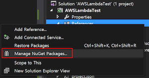

`json`만 입력해도 바로 가장 위에 **Newtonsoft.Json**이 나옵니다.

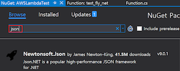

선택하여 설치해 줍니다.

`using`문에 다음을 추가해 주세요.

```CSharp
using Newtonsoft.Json.Linq;
```

`FunctionHandler` 메서드를 아래와 같이 수정해 주세요.

```CSharp
public Stream FunctionHandler(Stream stream, ILambdaContext context)
{
    List<byte> bytes = new List<byte>();
    while (stream.CanRead)
    {
        int readByte = stream.ReadByte();
        if (readByte != -1)
            bytes.Add((byte)readByte);
        else
            break;
    }

    string text = Encoding.UTF8.GetString(bytes.ToArray());

    var json = JObject.Parse(text);
    json["name"] = "LunaSter";

    text = json.ToString();

    MemoryStream stream1 = new MemoryStream(Encoding.UTF8.GetBytes(text));
    return stream1;
}
```

위 코드에서 `text`를 `JObject`로 변경한 다음 항목을 하나 추가해서 `MemoryStream`으로 응답하는게 추가되었습니당.

다시 배포한 뒤 테스트 해보니 이쁘게 **JSON** 형식으로 응답이 옵니다.
추가한 항목에 대해서도 확인됩니다.


### 마치며...

이번 포스팅에서 알아본 내용들은 다음과 같습니다.

- **Lambda**에 **C#** 코드 작업에 필요한 도구들 (설치법은 셀프!)
- Project 생성
- **Visual Studio**에서 **Lambda** 배포 및 테스트
- **JSON Object**로 입력 및 응답을 주고 받는 방법

**API Gateway**와의 연동 및 **path**, **querystring**, **HTTP Method**에 따라 다른 작업 및 응답을 발성하는 방법에 대해서는 제가 앞서 작성한 **Node.JS**로 **AWS Lambda** 올리는 곳의 코드와 구조가 똑같습니다.
그래서 이 부분에 대해서는 따로 다루지 않겠습니다.

잘못되었거나, 변경된 점, 기타 추가 사항에 대한 피드백은 언제나 환영합니다. - <seokjoon.yun@gmail.com>  

### 참고

- AWS 공식 문서들
  - <https://aws.amazon.com/about-aws/whats-new/2016/12/aws-lambda-supports-c-sharp/>
  - <http://docs.aws.amazon.com/toolkit-for-visual-studio/latest/user-guide/getting-set-up.html>
  - <http://docs.aws.amazon.com/lambda/latest/dg/lambda-dotnet-how-to-create-deployment-package.html>
  - <http://docs.aws.amazon.com/lambda/latest/dg/lambda-dotnet-create-deployment-package-toolkit.html>
  - <http://docs.aws.amazon.com/lambda/latest/dg/dotnet-programming-model.html>
  - <http://docs.aws.amazon.com/lambda/latest/dg/dotnet-programming-model-handler-types.html>


