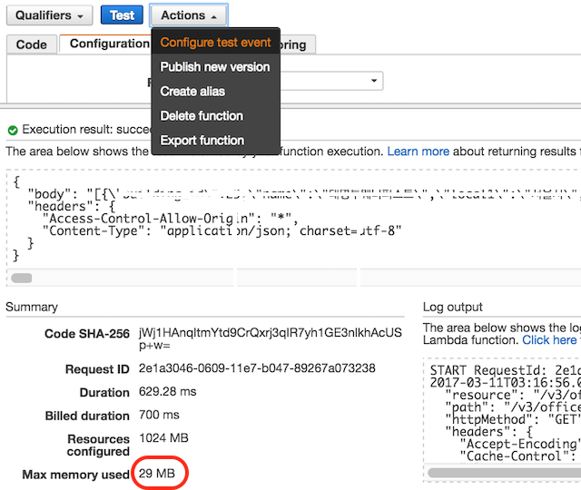
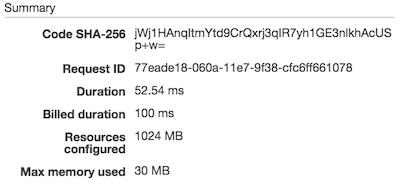
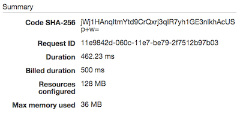

# AWS Lambda 사용에 관련된 Tip

그동안 AWS Lambda를 사용하면서 알게된 내용들과 최근 읽은 Lambda 관련 포스팅 내용들을 정리해 보았다.

## 1. Memory Configuration

[Lambda의 과금](https://aws.amazon.com/lambda/pricing)은 `실행 시간 x 사용한 메모리`에 의해 결정된다.

Lambda 실행에 메모리를 얼마나 사용하지는지를 볼려면 Lambda 내의 `Test`기능을 이용하면 확인이 가능하다.



위 그림을 보면 **1024 MB**로 설정되어 있으며, 실제 사용량은 **29 MB**란 것을 알 수 있다.

Lambda가 실행하는 인스턴스의 성능은 메모리 설정값에 비례해서 CPU 성능도 결정되기 때문에 메모리 사용량이 적다고 무조건 거기에 맞게 설정을 하면 당연히 그만큼 수행시간이 길어 질 수가 있다.




메모리를 1/10 정도로 줄이니 수행시간도 10배 정도로 더 늘어난 것을 확인할 수 있다.
그러므로 최소 과금으로 설정을 하기위해서 메모리를 무조건 수행가능한 최소로 설정하는 것보다는 설정값을 바꿔가면서 테스트를 해보고 결정을 하면 된다.
이렇게 미리 테스트를 해보면 이왕이면 같은 금액이면서 좀 더 빠르게 수행하는 방향으로 설정하는게 가능하다.

과금보다 빠른 서비스가 더 중요한 경우라면 메모리를 무조건 최대로 설정하는게 좋다.
하지만 메모리를 높인다고 해서 무조건 그만큼 더 빨리지는건 아니다. Lambda에서 동작하는 작업 성격에 따라 메모리 설정을 더 늘려도 더 이상 수행시간이 줄어들지 않거나 줄어드는 비중이 급격히 낮아지는 구간이 있으니 테스트 해본 후 적절히 설정하면 된다.

## 2. Warm Start

Lambda를 실행하면 해당 코드를 컨테이너 같은데 할당하여 EC2 instance 형식으로 수행하는 것으로 알려져 있다.
그래서 최초 수행시 cold start(해당 자원을 할당받는 시간) 때문에 수행시간이 좀 더 걸린다.
위에 그림을 보더라도 첫번째 그림과 두번째 그림의 메모리 설정값이 같은데 수행시간이 다르다.


그걸 방지하는 방법으로 [CloudWatch Schedule Event](http://docs.aws.amazon.com/ko_kr/AmazonCloudWatch/latest/events/ScheduledEvents.html)를 이용해서 5분 간격으로 Lambda를 한번씩 호출해주면 늘 warm start(바로 수행이 가능한 상태)로 유지가 가능하다.
실제로 Lambda가 수행되면 안될 경우에 호출되었을 때를 대비해서 따로 ping 같은 요청에 대해서 아무 일도 하지 않도록 코드를 추가해 주어야 한다.

하지만 이것이 모든것을 해결해주는 것 같지는 않다.
회사에서 다른 동료분이 테스트 해본 결과를 보니 이미 warm start 가능한 Lambda가 떠있는 상태에서 호출이 많아져서 새로운 인스턴스로 Lambda를 올려야 하는 경우를 보니 cold start로 수행되는 것 같다는 결론에 도달했다.
아직 정확히 어떻게 동작하는지에 대해서 알려진바가 없으니 테스트를 수행하면서 응답시간이 얼마나 걸리는지를 가지고 추측할 뿐이다.


## 3. Re-use Lambda

위 항목에서 얘기했드시 Lambda가 warm start되는 경우 기존에 실행한 컨테이너를 재사용해서 수행한다.
이를 이용해서 Lambda 수행시간을 짧게 할 수 있도록 코드 작성이 가능하다.

전역 변수를 선언해 놓고 그 값으로 테스트 해보니 warm start되는 Lambda의 경우 그 값을 계속해서 가지고 있다.

이를 이용해서 각종 라이브러리(npm 포함)들에 대한 초기화 코드를 handler 안에서가 아니라 전역에서 수행해두면 warm start의 경우 다시 초기화 코드를 수행하지 않아도 된다. 단, 이로 인해 발생하는 사이드 이펙트가 있는 경우에는 그것에 대한 방어코드가 추가되어야 한다.

DB 커넥션 역시도 매번 `연결 -> 쿼리수행 -> 종료`를 수행하는것 보다는 전역에 커넥션 객체를 두고 연결이 안된 경우에만 연결을 수행하고 계속해서 재사용하는 것도 가능하다.
이 경우 재사용되는 Lambda에서는 다시 연결할 필요가 없으니 빨라진다.
하지만 자주 사용되지 않은 Lambda에 대해서는 DB 입장에서 비효율적이니 사용하면 안좋을 것이다.

그리고 필요없이 DB 커넥션이 오랫동안 유지될 수 있다는 단점도 있다.
예를 들어 평균 초당 100번 수행되며 평균 수행시간이 100ms인 Lambda의 경우 10개의 인스턴스가 활성화되어 있을 것이다.
그런데 갑자기 1초에 200개의 요청이 오고, 그 다음부터 다시 1초당 100번의 요청이 오는 경우를 생각해보자.
갑자기 200개의 요청이 온 것 때문에 10개의 인스턴스가 추가로 할당될 것이다. 그 다음부터는 다시 10개의 인스턴스만 있어도 수행이 되기 때문에 나머지 10개의 인스턴스에서는 15분 가량동안 사용하지 않는 DB 커넥션을 끊지 않고 계속 가지고있게 된다.

장점과 단점을 같이 가지고 있는 방법이므로 판단은 각자 알아서 하길 바란다. 

## 4. Lambda Limit

각 리젼별로 Lambda가 100개 동시 수행이 가능한 것으로 기본설정 되어 있다.
이를 넘길 경우 Lambda가 수행되지 않는다.
그래서 동시 수행되는 Lambda수를 제어하기 위해서 SQS를 활용하는 방법이 있다.
Lambda를 바로 요청하지 않고 해당 요청을 SQS로 보내고 SQS에서 동시 실행되는 Lambda 수를 고려해서 호출을 하는 방법이다.

[관련 수식](http://docs.aws.amazon.com/ko_kr/lambda/latest/dg/concurrent-executions.html)에 따르면 아래와 같이 계산이 가능하다.

```
Concurrent Invocations = events (or requests) per second * function duration (in secs)
```

하지만 API Gateway + Lambda를 활용한 Web API Service와 같이 요청시간이 늘어나는 것이 안되는 경우도 있다.
이 경우에는 AWS에 요청하면 늘려준다.
이 경우 Lambda 뿐만 아니라 EC2의 Network Interface (350이 MAX)과 API Gateway (초당 1000번)의 리미트도 같이 늘려야 할수 있으니 잘 계산해서 같이 요청을 해야 한다.
참고로 현재 회사에서 사용중인 리미트는 Lambda 6000, Network Interface 4000, API Gateway 6000 per second 로 늘려놓은 상태이다. 

## 5. Devide Batch Task for Lambda

참고로 이 내용은 직접 겪은게 아니라 [Do’s and Don’ts of AWS Lambda](https://medium.com/@tjholowaychuk/dos-and-don-ts-of-aws-lambda-7dfcab7ad115#.xm94uvr5l)를 참고한 내용이다.

Lambda로 Batch 작업을 나눠서 작업해야 할 경우 해당 작업을 얼마나 잘게 나눠서 각 Lambda로 할당을 해야하는지에 대해서 고민을 해야한다.
대체적으로 연산이 많아서 CPU 사용량이 많은 경우는 최대한 Lambda로 잘게 나누는게 좋다.
반면 Lambda 자체의 연산보다는 외부 I/O 작업이 많은 경우는 Lambda 하나의 수행시간을 길게 가져가는게 좋다.

어찌보면 당연한 말같다.
CPU 연산이 많으면 최대한 병렬로 나누어서 CPU를 많이 사용하는 것이 당연히 좋을 것이다.
반면, DB 연결, SQS, Kinesis 등 다른 서비스 호출 등의 통신이 필요한 경우 커넥션을 맺는 오버해드가 있으니 한 번 연결을 맺고 계속해서 수행하는게 좋을 것이다.

## 6. Logging in Lambda

Lambda 수행 중 로그를 수집하기 위해서 외부 서비스를 사용하면 그만큼 Lambda 성능에 영향을 미치게 된다.

코드에서 **Node.JS**의 경우 `console.log, console.info`, **.NET core**의 경우 ` Console.Writeline`로 출력을 하면 CloudWatch에서 확인이 가능하다.
이 방법을 이용하면 Lambda 성능에는 거의 영향을 미치지 않고 로그를 남길 수 있다.

하지만, CloudWatch 사용 또한 유료이기 때문에 무한정 쌓아둘수는 없다. 특정 기간 이후에 것을 S3로 보관하는 것도 가능하며, CloudWatch에 쌓인 로그를 다른 방법으로 별도 로그 시스템으로 저장을하면 원래 수행중인 Lambda 성능에는 영향을 주지 않고도 로그 수집이 가능하다.

-----------

### 참고
- Do’s and Don’ts of AWS Lambda : <https://medium.com/@tjholowaychuk/dos-and-don-ts-of-aws-lambda-7dfcab7ad115#.xm94uvr5l>
- Best practices – AWS Lambda function : <https://cloudncode.blog/2017/03/02/best-practices-aws-lambda-function>

