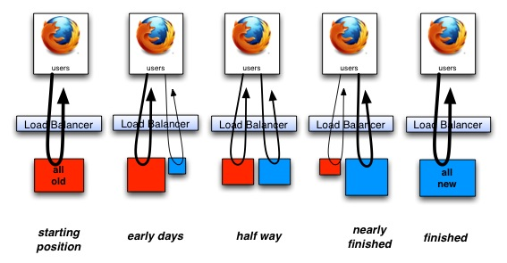

좋은 마이크로서비스란 ??
강한 응집력과 느슨한 결합력

### 공유 데이터베이스

가장 일반적인 통합 형태로 모든 공유 정보를 데이터베이스에 저장하여 그 정보를 토대로 전체 시스템을 통합하는 방법.
하지만, 다음과 같은 여러 가지 문제가 있음.

1. DB 스키마 변경시 관련 서비스들에 오류가 발생할 수 있다.
2. 각 서비스의 사용 기술을 선택하는데 제한이 생길 수 있다. 해당 DB와 통신이 가능해야만 한다.
3. 쿼리 로직이 각 서비스 별로 존재해야하므로 버그가 발생할 가능성이 있는 곳이 산제되어 있으므로 응집력과의 거리가 멀어진다.

### 동기와 비동기

- 동기(synchronous) : 서버에 요청후 응답을 기다림. (request/response 기반)
- 비동기(asynchronous) : 호출 후 응답을 기다리지 않음. (event 기반)

### 오케스트레이션(orchestration) 과 코페오그래피(choreography)

- 오케스트레이션 : 오케스트라 지휘자처럼 중앙 서비스가 모든 동작을 명령
- 코레오그래피 : 이벤트를 발생시키면(observable) 해당 이벤트 들의 구독자(subscriber)가 그것에 반응해서 각자 역할을 수행

### MSA 에서의 DRY

- DRY(don't repeat yourself) : 중복된 코드를 재작성하지 마라.

DRY를 너무 강조하다보면 MSA의 서비스들이 지나치게 결합되어질 수 있다.
개별 MSA 안에서는 DRY를 지켜야 하지만 전체 서비스간의 DRY 위반은 너무 걱정하지 않아도 된다.
서비스 간의 지나치게 강한 경합이 가져오는 해악이 코드 중복으로 초래하는 문제보다 더 심각하기 때문이다.

### UI 컴퍼넌트 구성

- 전통적인 프론트엔드 방식은 UI에서 필요한 데이터를 API를 통해서 가져오는 방식
- 각각의 UI가 서로 독립적이라면 프론트엔드는 해당 UI들의 레이아웃만을 정의하고 각 UI 컴퍼넌트를 제공해주는 API를 사용

### BFF (backend for frontend) : 프론트엔드를 위한 백엔드

- 대부분의 경우 각각의 서비스(모바일, 웹, 어드민)들이 단일 API Gateway를 통해서 API를 호출
- BFF는 각 서비스별로 별도의 백엔드를 구성해서 해당 백엔드가 필요한 API를 호출

### 상용제품과의 통합

- 대부분의 상용제품의 경우 실제 사용하기에는 기대에 못미치는 경우가 많음
- 그렇다고 그걸 커스터마이징하기에는 굉장히 많은 노력이 필요함
- 이 경우 서비스 파사드를 앞단에 배치하고 외부 서비스를 내부에 심어놓거나 외부 서비스의 API만을 사용하기도 함

### 교살자 패턴([Strangler Applcation Pattern](https://www.martinfowler.com/bliki/StranglerApplication.html))

레거시 시스템을 안전한 방법으로 새로운 시스템으로 옮기는 방법이다.
기존 시스템 전체를 다 한번에 옮기는 것이 아니라 구 버전 시스템으로의 호출을 가로채어서 신규 시스템에서 처리하는 방식으로 하나하나 씩 기능을 교체하는 방식으로 진행한다.
2004년 마틴 파울러에 의해서 명칭이 만들어졌다.

  
<http://paulhammant.com/2013/07/14/legacy-application-strangulation-case-studies>