# Jupyter notebook markdown에 내가 원하는 css 적용하기  (Linux / Mac OS)

`Windows`에서 설정하는 방법에 대해서는 저번에 포스팅 한 적이 있습니다.

<http://seokjoonyun.blogspot.kr/2016/08/jupyter-notebook-markdown-css.html>

하지만... `Mac OS`에서는 다르더군요.
(아마 `Linux`와 `Max OS`는 같을 것으로 추정됩니다.)
디렉토리 구조도 다르고, 참조하는 css 파일의 종류, 개수, 순서... 다 다릅니다.
찾기도 쉽지 않았습니다.
결국 찾긴 했지만요.
이번 포스팅에서는 제가 찾기 위해 삽질한 방법들과 수정 방법, 그 결과를 공유하고자 합니다.

## 1. Macbook에서 Jupyter notebook을 실행

맥북 구입후 **Python** 및 **Anaconda**를 설치한 후, 부푼 맘을 가진체 **Jupyter notebook**을 실행해 보았습니다.

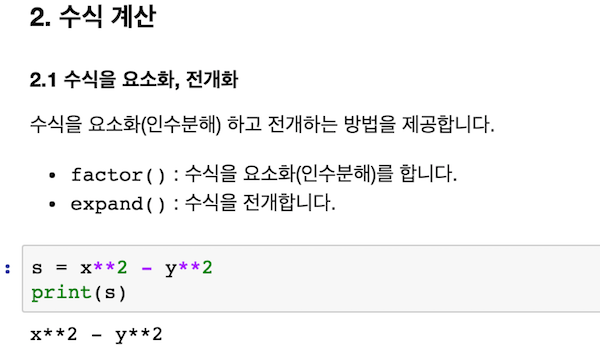

역시 맥북용 폰트는 이쁩니다. 그런데, `Windows`에서 설정한 한 `Markdown`의 렌더링결과가 적용되어 있지 않습니다.
당연한 거지요.
새로 설치했으니깐요.
그래서 `Windows`에서 제가 수정한 내용을 토대로 `sytle.min.css`를 찾아서 수정을 했습니다.
폴더 구조가 조금은 달랐지만, 대충 **Anaconda** 밑에 있는 **Notebook** 폴더 중 가장 최신 버전을 수정했는데...

아무 것도 변한게 없습니다.
어라~ 흠...

## 2. 용의자 확보

`Cmd + Opt + I`를 눌러서 적용된 **css**를 다시 찾아봤습니다.

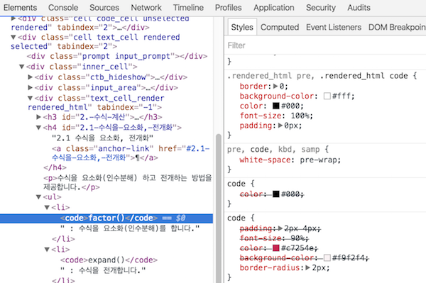

제가 적용한 내용들이 모두 빨간줄 찍찍찍.
그리고 그 위에 뭔가 다른 **css**가 우선순위가 높게 적용되어 있군요.
일단 진범이 있다는 사실은 확보했습니다.
이제 저 녀석을 잡아야 합니다.
분명 범인은 어딘가 흔적을 남겼을 것이기에 그것을 찾아서 추적해 보았습니다.

`Windows`에서 수정할때는 위 스샷의 **css**정보만으로도 잡을 수 있었는데, 이번엔 범인도 좀 더 스마트해 졌습니다.
그래서 좀 더 무식한 방법으로 찾아봤습니다.
그냥 **html** 자체를 열어봤습니다.

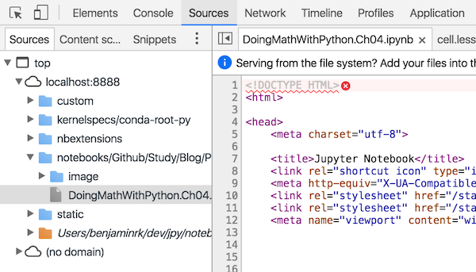

저 내용을 일단 다른 에디터로 열었습니다.
(필자의 경우는 **Visual Studio Code**를 사용)
그래서 `.css`로 검색을 했죠.

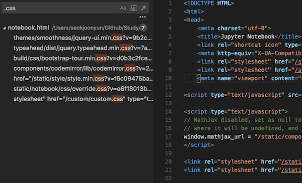

총 7개가 나왔군요.
이제 용의자를 확보되었습니다.
한 명씩 직접 만나서 확인을 해 보겠습니다.

## 3. 진범을 찾아서...

한 명씩 직접 찾아가 보도록 하겠습니다.
상대경로가 있긴하지만, 정확히 어느 위치에서 **Notebook**이 실행되는지 정확히 잘 모르니깐, 그 정보를 토대로 범인의 집을 찾아가긴 힘들 것 같고...
일단 범인이 우리나라 (내 맥북 안)에 거주하는건 확실하기 때문에 전체에서 찾아 봤습니다.

```
sudo find / -name 'jquery-ui.min.css'
```

겁나 많이 뜹니다.
그렇겠죠 `jQuery`를 사용하는 곳은 한 두 곳이 아닐테니깐요.
수사 범위를 좀 좁혀봤습니다.
우리나라 전체가 아닌 범행이 일어난 도시 (내 루트폴더 안)에서만 검색해 봤습니다.

```
sudo find ~ -name 'jquery-ui.min.css'
```

```
/Users/seokjoonyun/.pyenv/versions/anaconda3-4.1.0/lib/python3.5/site-packages/matplotlib/backends/web_backend/jquery/css/themes/base/jquery-ui.min.css
/Users/seokjoonyun/.pyenv/versions/anaconda3-4.1.0/lib/python3.5/site-packages/notebook/static/components/jquery-ui/themes/smoothness/jquery-ui.min.css
/Users/seokjoonyun/.pyenv/versions/anaconda3-4.1.0/pkgs/matplotlib-1.5.1-np111py35_0/lib/python3.5/site-packages/matplotlib/backends/web_backend/jquery/css/themes/base/jquery-ui.min.css
/Users/seokjoonyun/.pyenv/versions/anaconda3-4.1.0/pkgs/notebook-4.2.1-py35_0/lib/python3.5/site-packages/notebook/static/components/jquery-ui/themes/smoothness/jquery-ui.min.css
/Users/seokjoonyun/.pyenv/versions/anaconda3-4.1.0/pkgs/notebook-4.2.2-py35_0/lib/python3.5/site-packages/notebook/static/components/jquery-ui/themes/smoothness/jquery-ui.min.css
/Users/seokjoonyun/anaconda/lib/python3.5/site-packages/matplotlib/backends/web_backend/jquery/css/themes/base/jquery-ui.min.css
/Users/seokjoonyun/anaconda/lib/python3.5/site-packages/notebook/static/components/jquery-ui/themes/smoothness/jquery-ui.min.css
/Users/seokjoonyun/anaconda/pkgs/matplotlib-1.5.1-np111py35_0/lib/python3.5/site-packages/matplotlib/backends/web_backend/jquery/css/themes/base/jquery-ui.min.css
/Users/seokjoonyun/anaconda/pkgs/notebook-4.2.1-py35_0/lib/python3.5/site-packages/notebook/static/components/jquery-ui/themes/smoothness/jquery-ui.min.css
/Users/seokjoonyun/anaconda/pkgs/notebook-4.2.2-py35_0/lib/python3.5/site-packages/notebook/static/components/jquery-ui/themes/smoothness/jquery-ui.min.css
```

그래도 좀 많군요.
근데 21C에... **Termianl**에서 키보드로 명령 내려서... 뭐하는 짓인가 싶더라구요.
우린 문명인이고 마우스라는 좋은 도구가 있습니다.
난 도구를 사용할 줄 아는 **사피엔스**니깐요. 도구를 사용하도록 하겠습니다.

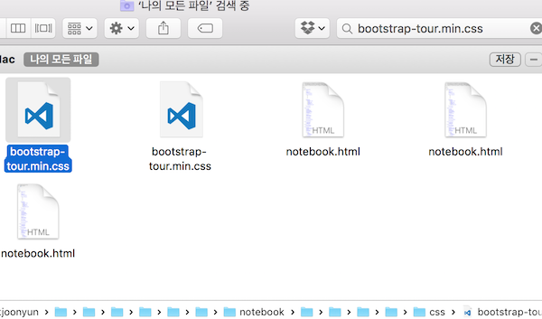

저런식으로 찾아서 **css** 파일을 열어서 내용 중 위 그림에서 보았던 `.rendered_html code`가 있는지 검색해 보았습니다.

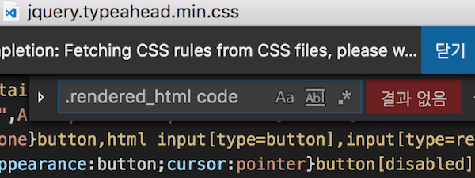

범인이 아니라는 군요. 혹시 내가 올 줄 알고 미리 증거를 인멸한게 아니냐는 의구심이 들지만, 아직 다른 용의자가 많이 남았기에 그냥 보내주었습니다.

계속해서 반복해서 용의자들을 직접 만나보았습니다.

## 4. 유력한 용의자 확보 !

용의자들을 한 명씩 찾아가서 증거 (`.rendered_html code`)에 대해서 물어보던 중 한 녀석이 걸렸습니다.

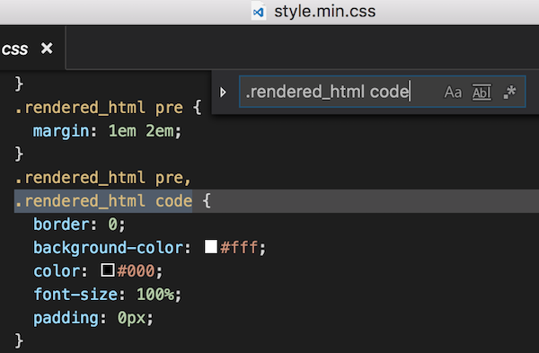

```
~/anaconda/lib/python3.5/site-packages/notebook/static/style/style.min.css
```

딱 걸렸습니다.
위 그림에서 보았던 `.rendered_html code`의 내용과도 완벽하게 일치합니다.
얼릉 해당 파일을 `style.min.original.css`로 사본을 만들어 놓은 뒤 `Windows`에 적용했던 **css**내용들로 수정했습니다.
혹시 진범이 아닐 수도 있으니깐요.
그럴땐 다시 원래대로 되돌려 놓아야 하니깐요.

```css

.rendered_html pre,
.rendered_html code {
	font-family: Consolas,"Andale Mono WT","Andale Mono","Lucida Console","Lucida Sans Typewriter","DejaVu Sans Mono","Bitstream Vera Sans Mono","Liberation Mono","Nimbus Mono L",Monaco,"Courier New",Courier,monospace;

}

p code,
li code {
    border: solid 1px #e1e4e5;
    white-space: nowrap;
    background: #fff;
    color: #E74C3C;
    padding: 0 5px;
    overflow-x: auto;
}
blockquote {
		background-color: #fcf2f2;
		border-color: #dFb5b4;
		border-left: 5px solid #dfb5b4;
		padding: 0.5em;
}

.rendered_html h1 {
  font-size: 250%;
  margin: 1.08em 0 0 0;
  font-weight: bold;
  line-height: 1.0;
}
.rendered_html h2 {
  font-size: 200%;
  margin: 1.27em 0 0 0;
  font-weight: bold;
  line-height: 1.0;
}
.rendered_html h3 {
  font-size: 180%;
  margin: 1.55em 0 0 0;
  font-weight: bold;
  line-height: 1.0;
}
.rendered_html h4 {
  font-size: 150%;
  margin: 2em 0 0 0;
  font-weight: bold;
  line-height: 1.0;
}
.rendered_html h5 {
  font-size: 130%;
  margin: 2em 0 0 0;
  font-weight: bold;
  line-height: 1.0;
}
.rendered_html h6 {
  font-size: 110%;
  margin: 2em 0 0 0;
  font-weight: bold;
  line-height: 1.0;
}
```

위의 **tag** 들을 찾아서 수정했습니다.
해당 **tag**가 모두 다 있었습니다.
그 내용또한 `Winodws`에서 수정하기 전의 모습과 거의 유사했습니다.
일단 심증적으로는 진범일꺼란 확신이 들었습니다.

## 5. 진범 검거

수정한 내용을 저장하고 **Jupyter notebook** 종료 후 다시 실행해 보았습니다.

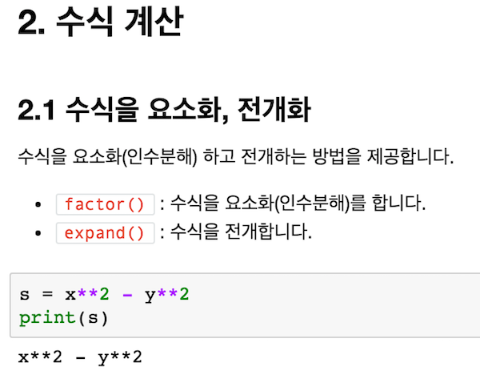

바뀌었습니다.
다른 부분도 살펴보았습니다.

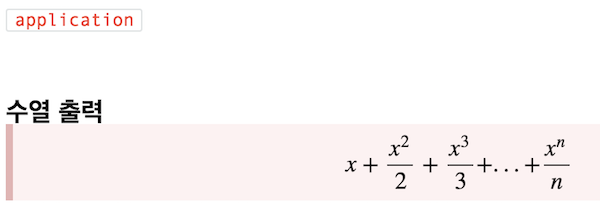

고친 곳이 한곳 더 있는데... 해당 Markdown을 사용한 곳이 없어서 즉석해서 수정을 해 봤습니다.

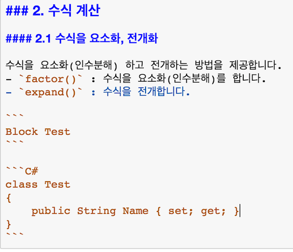

그런 후 렌더링을 해보니...

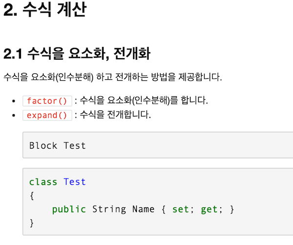

원하는대로 되었습니다.

## 6. 정리

```
~/anaconda/lib/python3.5/site-packages/notebook/static/style/style.min.css
```

버전에 따라, 설치한 방법에 따라 위치가 달라질 수는 있지만, **anaconda** 밑에 있는 **python3.5** 이하에 있는 **style.min.css**를 수정해야 합니다.
**notebook** 아래에도 같은 파일이 같은 내용으로 존재하지만, 저 파일을 먼저 적용하고 그 다음에 적용하기 때문에 같은 **tag**가 둘 다 존재할 경우 뒤에 읽는건 무시됩니다.

