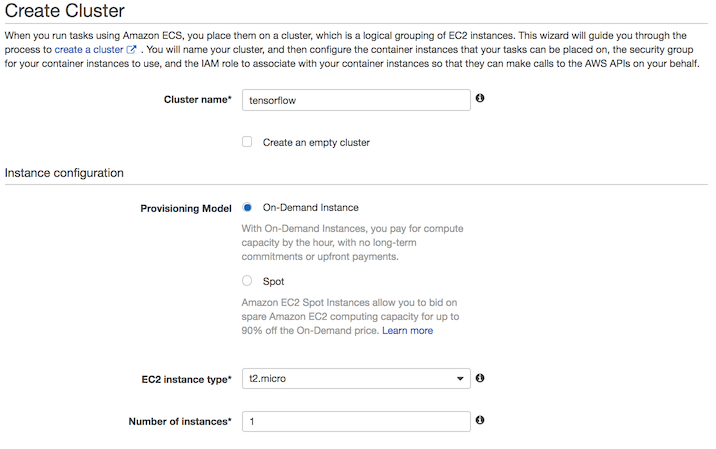
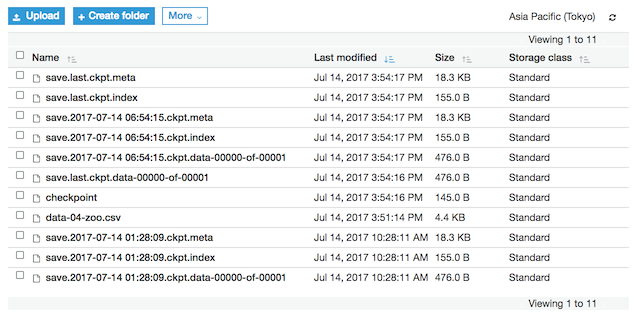
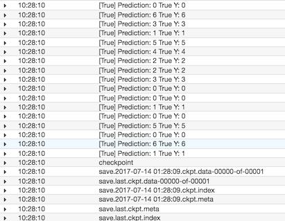

# Deploy Tensorflow Docker Image to AWS ECS

## 왜 이런 생각을 ???

Tensorflow 를 이용해서 학습시키는 것에 대한 예제코드는 많이 봐왔지만, 이렇게 학습시켜서 어떻게 서비스를 해야 할까에 대한 의문이 계속 생겼다. 아마 대량의 데이터를 학습해서 그 결과를 데이터베이스 같은데 넣어두고 그것을 읽어서 사용하는게 가장 대표적인 시나리오라 생각된다. 하지만, 그 경우가 아니라 실시간으로 서비스 하려면 어떻게 해야할까란 고민이 들었다. 거기에 관련된 특성들을 생각나는데로 정리해 보자면 다음과 같다.

- 학습 하는데는 긴 시간이 필요로 한다. 언제 끝날지 모른다.
- 이미 학습된 결과를 가지고 예측만 하는것은 아주 짧은 시간에 가능하다. 실시간 서비스로도 가능한 속도이다.
- 서비스 제공 중에 새로운 학습 데이터가 생길 경우 서비스를 제공함과 동시에 학습도 이루어 져야 한다.
- 새로운 데이터로 학습을 하면서 그 결과를 항상 서비스 쪽에서 접근 가능하게 유지한다면 항상 최신 데이터로 서비스가 가능하다.

새로 학습을 했으면 그 결과가 올바른지 검증이 필요하다고 생각할 수도 있다. 잘못된 정보를 제공하는건 위험한 일이니깐, 물론 맞는 생각이다. 하지만 지금은 그런 비지니스 적인건 생각하지 않고 일단 어떻게 시스템을 구축하는게 좋은가에 대해서만 고민하도록 하겠다.

## 그럼 어떻게 구성을 ???

크게 3가지 시스템을 생각해야 한다.

- 학습
- 저장
- 서비스

### 학습

학습의 경우 내 노트북이나 PC에서 돌려도 된다. 아니면 사내에 있는 별도의 ML전용 머신이 있으면 거기서 하면 좋다. 하지만 학습이 장시간에 걸쳐 이루어지는 경우도 생각해서 Cloud에서 실행하는 것을 생각해보자. AWS의 경우라면 EC2를 가장 쉽게 떠올릴 것이다. EC2에서 Tensorflow를 동작시키는 것은 너무나도 쉽고 관련 자료도 검색해보면 많이 나온다. 그래서 그 방법은 사용하지 않겠다. ECS (EC2 Container Service)를 이용해서 Dokcer Image로 만들어서 실행시키는 방법으로 진행해 보겠다. 학습이라는게 컴퓨팅 파워가 중요하다는 측면에서는 Docker Image로 실행하는게 안맞다는 생각도 들지만, 일정 시간마다 주기적으로 Task 실행이 가능하고, 학습을 하지 않아도 되는 시간에는 다른 서비스 이미지들을 Docker로 생성해서 돌릴 수도 있고 배포도 훨씬 편리해서 일단 Docker Image로 배포하는 것으로 방향을 잡았다.

### 저장

저장은 당연힌 S3에 저장을 하는게 가장 효과적이다. 학습 데이터 및 학습된 결과 데이터를 저장하는 하고 학습 결과에 대해서는 그 당시의 결과와 최신 데이터 이름은 고정으로 따로 저장해서 서비스 하는 곳에서는 항상 최신 데이터만을 가져와서 결과를 예측하는 식으로 구상이 가능하다.
만약 특정 시간마다 학습을 시키는 식으로 시스템을 구축한다면 S3에 학습데이터만 넣어주는 식으로 운영이 가능하며, 아니면 S3에 특정 파일을 저장할때마다 트리거를 이용해서 ECS를 실행하게끔 구성을 하면 될 것이다. 만약 트리거에서 바로 ECS 실행이 안된다면 중간에 Lambda를 이용해서 실행하게끔 구성을 하면 된다.

### 서비스

서비스는 EC2나 ECS를 이용한 정적 서버보다는 Lambda를 이용해서 Serverless 구조로 가는 것으로 선택했다. 학습된 데이터를 보고 예측을 하는것은 비교적 간단한 작업이라고 판단했으며, 비용적인 측면이나 관리적인 측면에서 Lambda로 결정했다.

하지만 여기에 조금의 문제가 있는데, 거기에 대해서는 따로 포스팅으로 다루기로 하겠다.

참고로 이번 포스팅에서 서비스 코드 및 방법에 대해서는 다루지 않고 S3와 ECS를 연동하여 학습데이터 및 학습결과를 이용하는 Docker Image를 배포하는 것까지만 다룬다.

서비스 코드에 대해서는 별도로 포스팅 할 예정이다.

## 작업전 가정할 상황들

- Python 3.6 버전이 개발PC에 설치되어 있다.
- Docker가 설치되어 있다.
- `AWS CLI`가 설치되어 있다.
- 배포할 AWS 계정정보에 대해서는 `~/.aws/credentials`에 `[default]`로 설정되어 있다. 만약 `[default]`가 아니라면 명령어에 `--profile 프로필명` 을 추가로 적어준다는 사실은 알고 있다.
- `S3`에 학습데이터 및 그 결과를 저장할 Bucket을 생성해 놓았다.

## Tensorflow 학습 코드

참고로 이 코드는 [김성훈 교수님의 모두를 위한 딥러닝 강좌](https://www.youtube.com/watch?v=BS6O0zOGX4E&list=PLlMkM4tgfjnLSOjrEJN31gZATbcj_MpUm) 에서 소개된 코드를 이용하였다.

동물의 여러가지 특징들에 대해서 입력받아서 이 동물의 종류가 무엇인가에 대한 학습데이터이다.

<https://archive.ics.uci.edu/ml/machine-learning-databases/zoo> 에서 해당 데이터 내용에 대해서 확인이 가능하다.

여기에는 김성훈 교수님이 미리 만들어 놓은 [data-04-zoo.csv](https://github.com/hunkim/DeepLearningZeroToAll/blob/master/data-04-zoo.csv) 파일을 이용하겠다.

- `data-04-zoo.csv`를 S3에 업로드
- 코드를 실행할 위치에 `saver`라는 폴더 생성 (`mkdir saver`)  


#### run.py
```Python
import tensorflow as tf
import numpy as np
import boto3
import datetime
import os

SAVER_FOLDER = "./saver"
BUCKET = 'S3버킷명칭'
TRAIN_DATA = "data-04-zoo.csv"

for file in os.listdir(SAVER_FOLDER):
    os.remove(SAVER_FOLDER + "/" + file);

s3_client = boto3.client('s3')
s3_client.download_file(BUCKET, TRAIN_DATA, TRAIN_DATA)

xy = np.loadtxt(TRAIN_DATA, delimiter=',', dtype=np.float32)
x_data = xy[:,0:-1]
y_data = xy[:,[-1]]
nb_classes = 7

X = tf.placeholder(tf.float32, [None, 16])
Y = tf.placeholder(tf.int32, [None, 1])

Y_one_hot = tf.one_hot(Y, nb_classes)
Y_one_hot = tf.reshape(Y_one_hot, [-1, nb_classes])

W = tf.Variable(tf.random_normal([16, nb_classes]), name='weight')
b = tf.Variable(tf.random_normal([nb_classes]), name='bias')

logits = tf.matmul(X,W) + b
hypothesis = tf.nn.softmax(logits)
cost_i = tf.nn.softmax_cross_entropy_with_logits(logits=logits, labels=Y_one_hot)
cost = tf.reduce_mean(cost_i)
optimizer = tf.train.GradientDescentOptimizer(learning_rate=0.1).minimize(cost)


prediction = tf.argmax(hypothesis, 1)
correct_prediction = tf.equal(prediction, tf.argmax(Y_one_hot, 1))
accuracy = tf.reduce_mean(tf.cast(correct_prediction, tf.float32))

saver = tf.train.Saver()

with tf.Session() as sess:
    sess.run(tf.global_variables_initializer())
    
    for step in range(2001):
        sess.run(optimizer, feed_dict={X: x_data, Y: y_data})
        if step % 100 == 0:
            print(step, sess.run([cost, accuracy], feed_dict={X: x_data, Y: y_data}))

    saver.save(sess,"./saver/save.{}.ckpt".format(datetime.datetime.now().strftime("%Y-%m-%d %H:%M:%S")))
    saver.save(sess,"./saver/save.last.ckpt")

    pred = sess.run(prediction, feed_dict={X: x_data})
    
    for p, y in zip(pred, y_data.flatten()):
        print("[{}] Prediction: {} True Y: {}".format(p == int(y), p, int(y)))


#s3_client = boto3.client('s3')
for file in os.listdir(SAVER_FOLDER):
    print(file)
    s3_client.upload_file(SAVER_FOLDER + "/" + file, 'dev-tensorflow-savedata', file)
``` 

PC에 tensorflow ,numpy, boto3가 설치된 상태라면 바로 실행해볼수도 있다.

```
pip install tensorflow numpy boto3

python run.py
```

## Docker 이미지 생성

Dokerfile을 생성한다.

#### Dockerfile
```Dockerfile
FROM python:3

RUN pip install tensorflow boto3 numpy

WORKDIR /usr/src/app

COPY . .

CMD [ "python", "./run.py" ]
```

```shell
docker build -t tensorflow-test .
```
커맨드를 입력하면 Docker Image가 생성된다. 시간이 많이 걸리는 작업이니 미리 실행해 두고 다음단계로 진행하는 것을 추천한다.

## EC2 Container Service 설정

Docker Image를 서비스해주는 AWS 기능이다. EC2 인스턴스를 띄워놓은 상태에서 ECS에 정의한 Docker Image를 수행시 EC2를 할당받아서 수행한다. 하나의 EC2에서 동시에 여러개의 Docker Image 실행이 가능하기때문에 자원을 더 효율적으로 사용할 수 있다.

ECS 설정에 대해서는 자세한 설명은 생략하고 작업 위주로만 순서대로 나열하겠다.

- 웹에서 AWS ECS 콘솔로 접근
  - Clusters 탭 선택
    - 
    - Create Cluster 버튼 클릭
      - Cluster name : `test-ecs-cluster`
      - EC2 instance type : t2.micro (가장 저렴한 인스턴스이다. 일단 테스트니깐 가장 저렴한걸로 구축하자.)
      - Networking : VPC, Subnets, Security group 설정 (먼저 설정된게 있으면 그것을 사용하면 되고 아니면 새로 생성)
      - Container Instance IAM role : S3, CloudWatch 등에 접근이 가능한 Role을 선택 or 생성 (Role 에 AmazonS3FullAccess Policy를 Attach)
      - Create 버튼 클릭
  - Repositories 탭 선택
    - Create repository 버튼 클릭
      - Repository name : `tensorflow-test`
      - Next Step 클릭
      - `Build, tag, and push Docker image 의 설명이 나옴`
        - AWS CLI 필요가 이미 설치되어 있어야 한다. 터미널 창을 연다.
        - 해당 PC에 AWS 계정이 여러개라면  `aws configure`를 이용해서 `[default]` 를 재정의 하던지 `aws` 명령어에 `--profile 프로필명`을 뒤에 붙여주어야 한다.
        - 맥이라면 1, Windows라면 2 에 적힌 커맨드를 입력 : ex 맥일 경우 `aws ecr get-login --no-include-email --region ap-northeast-1`
          - 만약 오류가 나면 AWS CLI를 업데이트 해야함
        - 입력후 나온 커맨드를 복사후 실행 (로그인 스크립트)
      - 3번에 적힌 문장 실행 : 도커 빌드 `docker build -t tensorflow-test .` (하지만 앞에서 미리 실행해 놓았다면 안해도 됨)
      - 위까지 다 성공했으면 4번, 5번을 차례대로 실행 : 태깅하고 Repository에 Push하는 기능이다.
  - Task Definitions 탭 선택
    - Create new task definition 클릭
      - Task Definition Name : `ts-test`
      - Task Role : 선택하거나 생성 (Role 에 AmazonS3FullAccess Policy를 Attach)
      - Add container 클릭
        - Container name : `ts-test-container`
        - Image : Repository 탭에서 `tensorflow-test`를 선택하여 `Repository URI`에 적힌 값을 입력
        - Memory Limits 설정 : ex) 128
        - CPU units 설정 : EC2 CPU 1개당 1024 개의 unit 이 생성됨. 할당한 숫자에 비례하여 실행됨
        - 로그를 남기고 싶다면 Log configuration 을 설정해야 한다.
          - Log configuration : `awslogs`
            - awslogs-group : `/aws/ecs/ts-test`
            - awslogs-region : 각자 입력 (ex. ap-northeast-1)
        - Add 클릭
      - Create 클릭

로그를 남기기로 설정했다면 아래와 같이 CloudWatch에 로그를 만들어야 한다.

- CloudWatch 콘솔로 접근
  - Logs 선택
    - Action -> Create Log Group
      - Name : /aws/ecs/ts-test

실행 방법이 여러가지가 있는데 일단 간단하게 콘솔에서 실행해 보겠다.

- Cluster 선택
  - `test-ecs-cluster` 선택
    - Tasks 탭
      - Run new Task 클릭
        - ts-test 선택
        - Run Task 버튼 클릭

작업이 정상적으로 수행완료가 되었다면 S3에 학습결과가 있는지 확인을 하면 된다.  



CloudWatch에 로그를 남기기로 설정했다면 로그도 확인이 가능하다.



### 다음글 Lambda를 이용하여 예측 서비스 제공하기

[Using Tensorflow Predict on AWS Lambda Function](https://github.com/DevStarSJ/Study/blob/master/Blog/Python/TensorFlow/ms/lambda.tensorflow.md)
