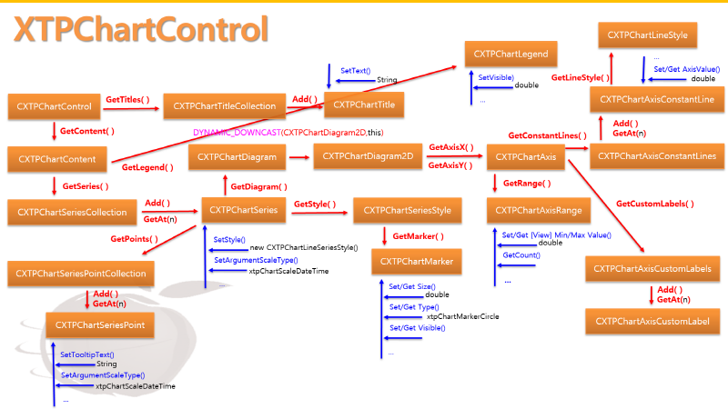

Xtreame Toolkip Pro의 Chart Control인 CXTPChartControl 사용시 알아야 할 class들 간의 상관관계를 Diagram으로 표시하였습니다.

XTPChart를 조금 사용해 본 소감은...  
만들다 말았다는 느낌 ???  

Mouse Click 이벤트 처리 같은거 ???  
NM_CLICK만 처리가 됩니다.   
ButtonDown, ButtonUp 같은거 처리 안됩니다.  
그냥 상속받아서 처리하세요.아래 글 참조하시면 됩니다.  

<http://devluna.blogspot.kr/2016/02/mfc-control-message.html>

분명 X-Argument로 날짜형식을 넣게는 되어 있는데,  
AxisRange를 이용해서 SetViewMin/MaxValue로 범위를 지정하면....  
제대로 안됩니다. double이나 CString 형으로는 잘 됩니다.  
굳이 날짜형식으로 쓸려면 Series가 바뀔때마다 GetMin/MaxValue로 값을 얻어와서  
그 값으로 계산을 해서 다시 SetViewMin/MaxValue로 값을 넣어야 합니다.  
자동으로 수정이 안됩니다. ;;;  

자세한 설명은 생략하겠습니다. 혹시나 Chart를 많이 안써보신 분들이 있을 수 있으니 대략적인 용어 및 뜻만 표기하겠습니다.

* Title
  - Chart에 표시되는 명칭입니다.
* Series
  - Chart에서 값을 나타내는 선을 나타냅니다.
  - 각 Point 들이 모여서 그 추이를 선으로 연결한 것입니다.
  - 각 Point는 X, Y 값의 2차원 값을 나타냅니다.
    - X 쪽을 Argument 라고 하며,
    - Y 쪽을 Value 라고 합니다.
* Marker
  - Series 에 보면 각각의 Point를 눈에 띄게 좀 큰 점으로 표현한 것을 Marker라고 합니다.
* Axis
  - X, Y 축 입니다.
* Legend
  - 각 Series 들이 어떤 값을 나타내는지 Chart 한쪽에 색깔 별로 소개해 놓은 범주를 의미합니다.
* ConstantLine
  - Chart 상의 특정 지점에 기준 선을 그어 놓는 경우가 있습니다.
    - 통계 관련 Chart의 경우 Y-Axis 상에 +- 1 sigma에 점선을 가로로 그어 놓는다던지 ...
    - X-Axis 상의 특정 시간안에 값들에 대해서 표시하기 위해서 세로로 그어 놓는 등...

위 그림은 Posting 목적으로 해상도를 줄여 놓았습니다.  
원래 크기대로 보실려면 아래 Link를 눌러주세요.

<image/XTP.diagram.png>
